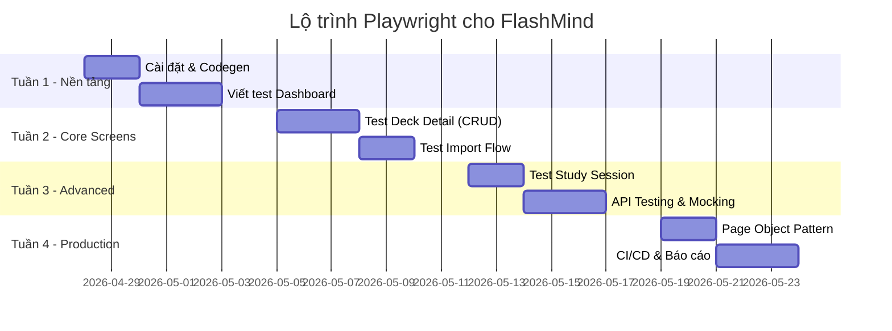

# 🗺️ Lộ Trình Học & Triển Khai Playwright — FlashMind Project

> Lộ trình 4 tuần, thiết kế riêng cho project FlashMind, kết hợp với nội dung Chương 7 của khóa học.

---

## 📅 Tổng Quan Lộ Trình



---

## 🔗 Mapping với Chương 7 Khóa Học

| Bài trong khóa học | Mapping vào lộ trình Playwright |
|---|---|
| Bài 2: Unit Testing & Level Testing | **Tuần 1** — Hiểu E2E testing nằm ở đâu trong testing pyramid |
| Bài 3: Prompt testing & fix bug | **Tuần 2-3** — Viết test theo specs, dùng AI prompt để sinh test |
| Bài 5: Kiểm tra chức năng hoạt động | **Tuần 2-3** — Chạy Playwright verify từng màn hình |
| Bài 6: Fix bug & cập nhật | **Tuần 4** — Debug failed tests, cập nhật test khi specs thay đổi |

---

## 📘 TUẦN 1: Nền Tảng (Ngày 1-5)

### Ngày 1-2: Setup & Khám Phá

**Mục tiêu:** Cài đặt Playwright, chạy test đầu tiên thành công ✅

**Việc cần làm:**

```bash
# 1. Cài đặt Playwright vào project
cd c:\laragon\www\vibe-coding
npm init playwright@latest

# 2. Chọn cấu hình:
#    - TypeScript: Yes
#    - Test folder: tests/e2e
#    - GitHub Actions: Yes
#    - Install browsers: Yes

# 3. Dùng Codegen để record test đầu tiên
npx playwright codegen http://localhost:8000/dashboard
```

**Cấu hình `playwright.config.ts`:**

```typescript
import { defineConfig } from '@playwright/test';

export default defineConfig({
  testDir: './tests/e2e',
  baseURL: 'http://localhost:8000',
  use: {
    screenshot: 'only-on-failure',
    video: 'retain-on-failure',
    trace: 'retain-on-failure',
  },
  webServer: {
    command: 'php artisan serve',
    port: 8000,
    reuseExistingServer: true,
  },
});
```

**Kiến thức cần nắm:**
- [ ] Locator cơ bản: `page.locator()`, `page.getByRole()`, `page.getByText()`
- [ ] Assertions: `expect(locator).toBeVisible()`, `.toHaveText()`, `.toHaveCount()`
- [ ] Navigation: `page.goto()`, `page.waitForURL()`

---

### Ngày 3-5: Test Dashboard

**Mục tiêu:** Viết 5-7 test cases cho Dashboard theo [01-Dashboard-Nghiep-vu.md](file:///c:/laragon/www/vibe-coding/app/Spec/Bussiness-Rule/Dasboard-Desk-Detail-%20Phase-2/01-Dashboard-Nghiep-vu.md)

**Test file: `tests/e2e/dashboard.spec.ts`**

| # | Test Case | Mapping Spec |
|---|---|---|
| 1 | Trang Dashboard load thành công, hiển thị lời chào | Mục 3.1 Header |
| 2 | Quick Stats hiển thị Streak và Milestone | Mục 3.2 Quick Stats |
| 3 | Active Decks grid hiển thị danh sách deck | Mục 3.3 Active Decks |
| 4 | Tạo Deck mới qua modal (name + description) | Mục 6 Create Deck |
| 5 | Xóa Deck với confirm dialog | Mục 3.3 Nút Delete |
| 6 | Click deck card → navigate đến Deck Detail | Mục 5 Điều hướng |
| 7 | Click "Review X Cards" → navigate đến Study | Mục 5 Điều hướng |

**Ví dụ test:**

```typescript
import { test, expect } from '@playwright/test';

test.describe('Dashboard', () => {
  test.beforeEach(async ({ page }) => {
    await page.goto('/dashboard');
  });

  test('hiển thị Active Decks grid', async ({ page }) => {
    await expect(page.locator('[data-deck-card]')).toHaveCount.greaterThan(0);
  });

  test('tạo Deck mới thành công', async ({ page }) => {
    await page.locator('[data-create-deck-button]').first().click();
    await page.fill('#new-deck-name', 'Test Deck');
    await page.fill('#new-deck-description', 'Mô tả test');
    await page.click('#create-deck-submit-btn');
    // Verify deck xuất hiện
    await expect(page.locator('[data-deck-card]').filter({ hasText: 'Test Deck' })).toBeVisible();
  });

  test('xóa Deck với xác nhận', async ({ page }) => {
    page.on('dialog', dialog => dialog.accept());
    await page.locator('[data-delete-deck-button]').first().click();
  });
});
```

---

## 📗 TUẦN 2: Core Screens (Ngày 6-10)

### Ngày 6-8: Test Deck Detail

**Mapping spec:** [02-Deck-Detail-Nghiep-vu.md](file:///c:/laragon/www/vibe-coding/app/Spec/Bussiness-Rule/Dasboard-Desk-Detail-%20Phase-2/02-Deck-Detail-Nghiep-vu.md)

**Test file: `tests/e2e/deck-detail.spec.ts`**

| # | Test Case | Mapping Spec |
|---|---|---|
| 1 | Table hiển thị đầy đủ cột (Front, Back, Status, Last Reviewed, Next, Actions) | Mục 3.4 |
| 2 | Search cards theo front/back text | Mục 3.3 |
| 3 | Filter theo Status (New/Learning/Review) | Mục 3.3 |
| 4 | Create Card qua modal | Mục 3.2 |
| 5 | Edit Card - modal hiển thị data cũ | Mục 5 |
| 6 | Delete single card với confirm | Mục 5 |
| 7 | Bulk select + bulk delete | Mục 5 |
| 8 | Select All checkbox behavior | Code app.js line 185-221 |
| 9 | Deck Switcher navigation | Code app.js line 114-120 |

**Kiến thức mới cần học:**
- [ ] Làm việc với `<dialog>` modals
- [ ] Table assertions: kiểm tra số row, nội dung cell
- [ ] Checkbox interactions: `.check()`, `.uncheck()`, `isChecked()`

---

### Ngày 9-10: Test Import Flow

**Test file: `tests/e2e/import.spec.ts`**

| # | Test Case | Mapping |
|---|---|---|
| 1 | Upload file TXT → Preview hiển thị rows | Import flow |
| 2 | Filter rows (All/Valid/Warning/Invalid) | app.js line 316-321 |
| 3 | Confirm Import → success message | app.js line 348-358 |
| 4 | Confirm button disabled sau import | Spec mục 2 |
| 5 | Target Deck dropdown hoạt động | Import UI |

**Kiến thức mới:**
- [ ] File upload: `page.setInputFiles()`
- [ ] Kiểm tra disabled state: `expect(button).toBeDisabled()`

---

## 📙 TUẦN 3: Advanced (Ngày 11-15)

### Ngày 11-12: Test Study Session

**Mapping spec:** [03-Study-Session-Bo-Sung-Nghiep-vu.md](file:///c:/laragon/www/vibe-coding/app/Spec/Bussiness-Rule/Dasboard-Desk-Detail-%20Phase-2/03-Study-Session-Bo-Sung-Nghiep-vu.md)

**Test files: `tests/e2e/study-flip.spec.ts` & `study-typing.spec.ts`**

| # | Test Case |
|---|---|
| 1 | Flip Mode: Hiển thị front → Show Answer → Rating panel |
| 2 | Typing Mode: Nhập answer → Check → Answer Revealed |
| 3 | Progress bar cập nhật sau mỗi card |
| 4 | Empty state khi hết cards để học |
| 5 | TTS button hoạt động (không bị disabled) |
| 6 | Rating (Again/Hard/Good/Easy) → chuyển card tiếp |

---

### Ngày 13-15: API Testing & Network Mocking

**Test file: `tests/e2e/api.spec.ts`**

```typescript
import { test, expect } from '@playwright/test';

// Test API trực tiếp (không qua UI)
test.describe('API Tests', () => {
  test('GET /api/decks trả về danh sách', async ({ request }) => {
    const response = await request.get('/api/decks');
    expect(response.ok()).toBeTruthy();
    const data = await response.json();
    expect(Array.isArray(data)).toBeTruthy();
  });

  test('POST /api/decks tạo deck mới', async ({ request }) => {
    const response = await request.post('/api/decks', {
      data: { name: 'API Test Deck', description: 'Created via API test' }
    });
    expect(response.ok()).toBeTruthy();
  });
});

// Mock API để test UI edge cases
test('Dashboard hiển thị empty state khi không có decks', async ({ page }) => {
  await page.route('/api/decks', route =>
    route.fulfill({ json: [] })
  );
  await page.goto('/dashboard');
  // Verify empty state UI
});
```

**Kiến thức mới:**
- [ ] `request` fixture cho API testing
- [ ] `page.route()` cho network mocking
- [ ] `route.fulfill()` và `route.abort()`

---

## 📕 TUẦN 4: Production Ready (Ngày 16-20)

### Ngày 16-17: Page Object Pattern

**Tổ chức lại code test:**

```
tests/e2e/
├── pages/                    # Page Objects
│   ├── dashboard.page.ts
│   ├── deck-detail.page.ts
│   ├── import.page.ts
│   └── study.page.ts
├── fixtures/                 # Test data
│   └── sample-import.txt
├── dashboard.spec.ts
├── deck-detail.spec.ts
├── import.spec.ts
├── study.spec.ts
└── api.spec.ts
```

**Ví dụ Page Object:**

```typescript
// tests/e2e/pages/dashboard.page.ts
import { Page, Locator } from '@playwright/test';

export class DashboardPage {
  readonly createDeckButton: Locator;
  readonly deckCards: Locator;
  readonly deckNameInput: Locator;

  constructor(private page: Page) {
    this.createDeckButton = page.locator('[data-create-deck-button]').first();
    this.deckCards = page.locator('[data-deck-card]');
    this.deckNameInput = page.locator('#new-deck-name');
  }

  async goto() { await this.page.goto('/dashboard'); }

  async createDeck(name: string, description?: string) {
    await this.createDeckButton.click();
    await this.deckNameInput.fill(name);
    if (description) await this.page.fill('#new-deck-description', description);
    await this.page.click('#create-deck-submit-btn');
  }
}
```

---

### Ngày 18-20: CI/CD & Reporting

**GitHub Actions: `.github/workflows/playwright.yml`**

```yaml
name: Playwright Tests
on: [push, pull_request]
jobs:
  test:
    runs-on: ubuntu-latest
    steps:
      - uses: actions/checkout@v4
      - uses: actions/setup-node@v4
      - name: Install deps
        run: |
          npm ci
          npx playwright install --with-deps
      - name: Setup Laravel
        run: |
          composer install
          cp .env.example .env
          php artisan key:generate
          php artisan migrate
      - name: Run Playwright
        run: npx playwright test
      - uses: actions/upload-artifact@v4
        if: always()
        with:
          name: playwright-report
          path: playwright-report/
```

---

## 📊 Checklist Tổng Kết

### Tuần 1 ✅ Nền tảng
- [ ] Playwright cài đặt & config xong
- [ ] Codegen chạy được
- [ ] 5-7 test cases Dashboard pass

### Tuần 2 ✅ Core Screens  
- [ ] 9 test cases Deck Detail pass
- [ ] 5 test cases Import pass
- [ ] Tổng: ~20 test cases

### Tuần 3 ✅ Advanced
- [ ] 6 test cases Study Session pass
- [ ] API tests hoạt động
- [ ] Network mocking cho edge cases
- [ ] Tổng: ~30 test cases

### Tuần 4 ✅ Production
- [ ] Refactor sang Page Object Pattern
- [ ] CI/CD pipeline chạy tự động
- [ ] HTML Report được generate
- [ ] Tổng: ~30-35 test cases, production-ready

---

## 💡 Tips Thực Chiến

> [!TIP]
> **Tip #1:** Luôn chạy `npx playwright codegen` trước khi viết test mới. Record xong rồi chỉnh sửa code — nhanh hơn viết từ đầu rất nhiều.

> [!TIP]
> **Tip #2:** Project đã có `data-*` attributes chuẩn. KHÔNG dùng CSS class selectors (hay thay đổi) — luôn ưu tiên `[data-create-deck-button]`.

> [!WARNING]
> **Lưu ý:** Cần đảm bảo database có test data trước khi chạy test. Dùng Laravel seeders hoặc API setup trong `test.beforeEach()`.
